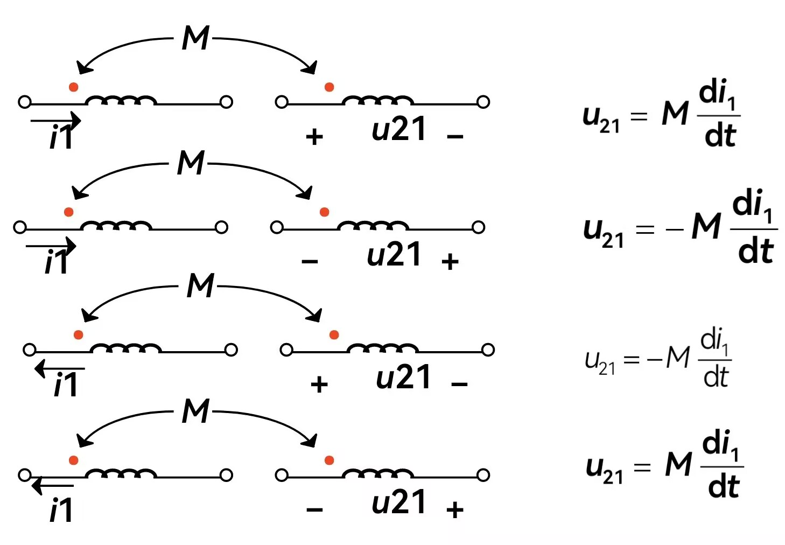
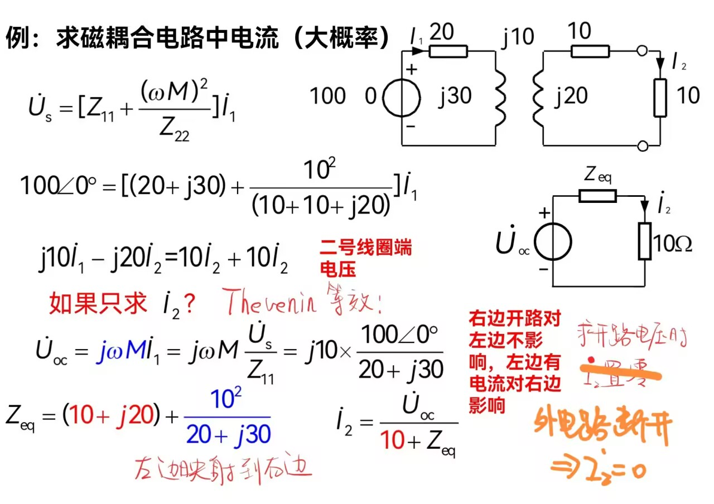

# circuit theory
## 电路模型与基本定律
$u$,$i$关联参考方向:电流方向与**电压降**方向一致

关联,$p=ui$表示吸收功率;非关联,$p=ui$表示发出功率

功率守恒 电阻吸收功率,电源发出/吸收功率

电导$G=\frac{1}{R}$ 单位西门子$S$

开路:$i=0$

受控电源

KCL:任一节点$\sum i=0$ 

"大节点"

N个节点,KCL独立方程数为$N-1$

KVL:闭合回路电压降为0

KVL独立方程数=网孔个数

## 电阻电路等效变换
二端网络等效:具有相同的对外伏安关系(对外部电路而言)

无源二端网络可等效为电阻

弄清串并联关系:看节点
### 电阻网络$Y$-$\Delta$变换
三端无源网络

三个电阻相等,则$\boxed{R_{\Delta}=3R_Y}$**外大内小**
### 电源等效变换
电压相同电压源才可并联,电流相同电流源才可串联

实际电压源串联$u=\sum u_i$,$r=\sum r_i$

实际电流源并联$i=\sum i_i$,$\frac{1}{r}=\sum\frac{1}{r_i}$

实际电压源、实际电流源可等效变换$R_S=R_P$且$I_S=\frac{U_S}{R_S}$
### 二端网络输入电阻
求二端网络入端电阻:加压求流;加流求压
## 电阻电路分析
### 支路电流法
未知数:各支路电流

列KCL、KVL方程
### 节点电压法
选取参考节点,其它节点电压为变量

方程本质是KCL

**$$自电导u_{n1}+\sum 互电导u_{ni}=理想电流源注入$$**

方程多时可写成矩阵形式

自电导$>0$,**互电导$<0$**

注入电流,等效成理想电流源计算

电路中含受控源时：①看作独立源列方程②受控量方程(节点电压表示)
### 网孔电流法
变量:网孔电流

网孔电流是虚拟电流

本质是用KVL

确定绕行参考方向

**$$自电阻I_m-\sum 互电阻I_{mi}=电压源电压升$$**
## 电路定理
### 叠加定理
齐次性原理:只有一个激励时,响应和激励成正比

应用:倒推法

叠加定理:**线性**电路中,响应为**各个电源单独作用**结果代数和

其它:电压源短路;电流源开路

功率非线性,不能叠加

叠加时注意分量方向

仅独立源叠加,**受控源始终保留**

### Thevenin-Norton Theorem
Thevenin等效:电压源串电阻

电压源电压:外电路断开的开路电压$U_{oc}$

电阻:独立电源全部置零,计算等效电阻

含受控源:控制电路与受控源包含在同一部分

***只求电路末端某个量，用Thevenin等效！***

Norton等效:电流源并电阻

电流源电流:短路电流

电阻:独立电源全部置零,计算等效电阻

### 最大功率传输定理
先Thevenin等效,$R_L=R_{eq}$时有 **$P_{max}=\frac{U_{oc}^2}{4R_{eq}}$**
### 特勒根定理
相同拓扑结构的两个电路:

1.$\sum u_ki_k=0$且$\sum \hat{u_k}\hat{i_k}=0$

2.$\sum u_k\hat{i_k}=0$且$\sum u_k\hat{i_k}=0$

支路电流电压非关联时取负数

注意利用同一个线性纯电阻网络的$\sum u_k\hat{i_k}=\sum u_k\hat{i_k}$
## 含运算放大器的电路
线性工作区、正反向饱和区

理想运放：线性区**虚短路**即$u_+=u_-$,**虚断路**$i_+=i_-=0$
## 电感、电容及动态电路
### 广义函数
单位阶跃函数 **$\varepsilon(t)$** 可描述开关动作

单位阶跃函数可以延迟、反转

闸门函数 **$G(t_1,t_2)=\varepsilon(t-t_1)-\varepsilon(t-t_2)$**

单位脉冲函数 **$p(t)$**

单位冲击函数 **$\delta(t)$**

### capacitor
线性电容有 **$i=\frac{dq}{dt}=C\frac{du}{dt}$**
$\Rightarrow u(t)=u(t_0)+\frac{1}{C}\int_{t_0}^t idT$与$t_0$有关,因此是记忆元件

电容储能$W_C=\frac{1}{2}Cu(t)^2-\frac{1}{2}Cu(-\infty)^2$
电容串并联：与电阻公式相反
### inductor
自感系数$L=\frac{\varPsi}{i}=N\frac{\Phi}{i}$单位$H$

$\varPsi$为磁链

线性电感 **$u=L\frac{di}{dt}$**
$\Rightarrow i(t)=i(t_0)+\frac{1}{L}\int_{t_0}^t uDT$

电感储能$W_L=\frac{1}{2}Li(t)^2-\frac{1}{2}Li(-\infty)^2$

电感串并联：与电阻公式相同
### 动态电路
暂态(瞬态):过渡状态

换路时$U_C$和$I_L$不发生突变
## 一阶电路暂态分析
**零输入响应**:外加激励为0

Zero Input Response
**零状态响应**:动态元件初始能量为0

全响应:均不为0
###  零输入响应
**RC电路的零输入响应**

**$u_c=U_0e^{-t/\tau}$**

**$i_c=I_0e^{-t/\tau}$**

其中 **$\tau=RC$** 为时间常数

$\tau$大表明过渡过程时间长

**RL电路的零输入响应**

**$i_L=I_0e^{-t/\tau}$**

**$\tau=\frac{L}{R}=GL$**
### 直流电源激励下的RC电路
三要素法

**$$\boxed{y(t)=[y(0_+)-y(\infty)]e^{-\frac{t}{\tau}}+y(\infty)}$$**

三要素:
- 初始值$y(0_+)$
- 稳态解$y(\infty)$
- 时间常数$\tau$

这是一阶线性电路在直流电源激励下的通解

由此得到**一阶电路的零状态响应**

**RC电路**

**$u_C=U_s(1-e^{-\frac{t}{RC}})$**

$i_c=C\frac{du}{dt}=\frac{U_s}{R}e^{-\frac{t}{RC}}$

**RL电路**

**$i_L=\frac{U_s}{R}e^{-\frac{R}{L}t}$**

$u_L=L\frac{di}{dt}={U_s}e^{-\frac{R}{L}t}$
### 线性非时变特性
除独立电源以外都是线性非时变元件

具有齐次性、可加性

于是全响应=零输入+零状态

************
## 正弦稳态分析
正弦交流电$f(t)=A\sin(\omega t+\psi)$

初相位$\psi$反映正弦量计时起点,是自$f(t)$开始至$t=0$经过的电角度

一般规定 **$\left\lvert \psi\right\rvert \leqslant \pi$**

对于**同频率**正弦量,相位差$\varphi$等于初相位之差

$\psi_u-\psi_i$

若$\varphi>0$则u超前i$\varphi$角(超前意味着先到达最大值)

电流有效值使用RMS value

$$I=\sqrt{\frac{1}{T}\int_0^T i^2(t)dt}$$

### **正弦量的相量(phasor)表示**
复数表示

$A=a+jb=\left\lvert A\right\rvert e^{j\theta}=\left\lvert A\right\rvert \left(\cos\theta+j\sin\theta\right)=\left\lvert A\right\rvert\angle\theta$

乘除运算采用极坐标形式方便

$e^{j\theta}$为**旋转因子**

特殊的旋转因子:
- **$j$为逆时针旋转$\frac{\pi}{2}$**
- **$-j$为顺时针旋转$\frac{\pi}{2}$**
- **$-1$为旋转$\pi$**

将复数投影到real/imagined轴上,也即取Re/Im

建立正弦量和复数的一一对应关系

同频率时,$\omega t$相同,此时只关心幅值和相位

于是$u=\sqrt{2}U\sin (\omega t+\psi)$

可以表示成 **$\dot{U}=U\angle\psi$** 以及 **$\dot{U_m}
=U_m\angle\psi$**

同样可以用相量表示电流

相量图:在复平面上表示相量

**使用相量计算**

加减:相量的向量和

**微分运算乘$j\omega$,积分运算除以$j\omega$**

**于是微分运算逆时针旋转90度(+90°,超前90°),积分运算顺时针旋转90度(-90°,滞后90°)**
### 相量法分析正弦稳态电路
**电阻**

$\dot{U}=R\dot{I}$

**电感**

**$\dot{U}=j\omega L\dot{I}$**

相位关系:**$\dot{U}$超前$\dot{I}$90°**

有效值关系$U=\omega LI$于是得出感抗$X_L=\omega L=2\pi fL$

**感抗$X_L=\omega L$** 为限制电流的能力，和频率成正比

于是 **$\dot{U}=jX_L\dot{I}$**

**电容**

**$\dot{U}=\frac{1}{j\omega C}\dot{I}$**

相位关系:**$\dot{I}$超前$\dot{U}$90°**

**容抗$X_C=\frac{1}{\omega C}$** 为限制电流的能力，绝对值和频率成反比

于是 **$\dot{I}=-jX_C\dot{U}$**

**解题时注意使用相量图**

### 复阻抗和复导纳
**复阻抗$Z=R+j(X_L-X_C)=R+jX$**

$X$为电抗
- $X>0$电压领先电流，电路呈感性
- $X<0$电流领先电压，电路呈容性
- $X=0$电压电流同相，纯电阻性

**复导纳$Y=G+j(B_C-B_L)=G+jB$**
$B$为电纳

**电压三角形和阻抗三角形相似，电流三角形和导纳三角形相似**

## 正弦稳态电路的功率
**瞬时功率**:$p=ui$

若一无源一端口网络有$u(t)=\sqrt{2}U\sin(\omega t+\varphi)$,$i(t)=\sqrt{2}I\sin(\omega t)$,则$p(t)=UI\cos \varphi(1-\cos(2\omega t))+UI\sin\varphi\sin(2\omega t)$,也即分解为$\text{恒正部分}+\text{交变部分}$,分别为电阻和电抗的瞬时功率

**有功功率**(平均功率)
$p=\frac{1}{T}\int_0^T p(t)dt$ **$=UI\cos\varphi$**

$\cos\varphi$为**功率因数**,1为纯电阻,0为纯电抗

$\varphi=\psi_u-\psi_i$为功率因数角，对于无源网络为阻抗的阻抗角

有功功率为电路实际消耗的功率,对应恒正部分,实际上是电阻消耗的功率

**无功功率**

**$Q=UI\sin\varphi$** 为可逆部分的峰值

$Q$的单位为**乏(var)**

电容与电感的无功功率互补

规定:$X>0\, \varphi>0$也即感性时为**滞后**

$X<0\, \varphi<0$也即容性时为**超前**

**视在功率**

$S=UI$单位为**伏安VA**

最大值为电气设备容量，也是有功功率可能的最大值

$S=\sqrt{P^2+Q^2}$于是有功率三角形,**且与电压三角形和阻抗三角形相似**

为了用phasor来计算功率,引入:

**复功率** **$\bar{S}=\dot{U}\dot{I}^*$**(*表示共轭复数)

复功率**单位VA**

$\bar{S}=\dot{U}\dot{I}^*=ZI^2=RI^2+jXI^2$

注意另外也可用导纳表示

$\bar{S}$把$P$,$Q$,$S$联系在一起，实部为有功功率，虚部为无功功率，模为视在功率

**复功率守恒**:正弦稳态下电路所有支路吸收复功率之和为0

并联电容,提高功率因数,可以降低电流(画相量图分析)

**功率因数的修正**

**并联电容$$C=\frac{P}{\omega U^2}(tg\varphi_1-tg\varphi_2)$$** 其中$\varphi_1,\varphi_2$分别为并联前后的功率因数角,$P$为有功功率

欠补偿:电路仍然为感性;过补偿:电路变为容性($\dot{I_C}$过大)

处理功率因数修正时注意使用三个三角形,尤其是功率三角形

**最大功率输出**

输入端复阻抗为$Z_i$,负载端复阻抗为$Z_L$,则

**$$P_{max}=\frac{R_L U_S^2}{(R_i+R_L)^2+(X_i+X_L)^2}$$**

取得最大功率的条件:**$R_L=R_i$,$X_L=-X_i$** 即 **$Z_L=Z_i^*$**

此时负载与内阻抗最佳匹配

**有功功率的测量**

使用瓦特表(分电压接线端和电流接线端)

## 三相正弦稳态电路

三相电源

$\dot{U_A}=U\angle 0\degree$,$\dot{U_B}=U\angle -120\degree$,$\dot{U_C}=U\angle 120\degree$

颜色对应黄、绿、红

$\dot{U_A}+\dot{U_B}+\dot{U_C}=0$

**对称三相电源的连接**

①Y形(星形)

火线(端线):A,B,C三段引出线

零线(中线):中性点N引出线

②$\Delta$形(三角形)

三个绕组始末端对应相接

同样有三相负载

对称三相电路
**线电压**:端线之间的电压

**相电压**:电源或负载每相的电压

**线电流**:每根导线上传播的电流

**相电压**:电源或负载每相的电压

**对Y接法线电压和相电压之间的关系**

**①相电压对称，则线电压也对称**

**②$U_l=\sqrt{3}U_p$** (line and phase)

**③相位:线电压领先对应相电压$30\degree$**

**$\Delta$形接法线电压等于对应相电压**

对于Y-Y形对称三相电路,$U_{nN}=0$,中线电流为0，故每一相可分别计算

Y-$\Delta$:对负载使用$\Delta$-Y变换

对于 **$\Delta$形负载** ，有：

**①负载上相电压与线电压相等**

**②线电流大小是相电流$\sqrt{3}$倍,线电流相位滞后相电流$30\degree$**

对于$\Delta$形电源,使用Y形接法关系将线电流换算成相电流($\Delta$形相电压看成是Y形的线电压)

**三相电路计算时将电源和负载都转化为Y形**

## 三相电路的功率
对称三相电路瞬时功率$p=p_a+p_b+p_c=3UI\cos\varphi$稳定，因此运行平稳

对称三相电路**有功功率$P=3U_pI_p\cos\varphi=\sqrt{3}U_lI_l\cos\varphi$**

注意 **$\varphi$为相阻抗角！**

若已知线阻抗角，则$\varphi=\angle\dot{U_{AB}}-\angle\dot{I_A}-30\degree$，即**减$30\degree$得相阻抗角**

无功功率$Q=3U_pI_p\sin\varphi=\sqrt{3}U_lI_l\sin\varphi$

三相功率的测量：①三表法（三相四线）②两表法（三相三线）（三相总功率为表的读书相加）

## 含磁耦合的电路
### 耦合电感
互感系数$M$

自感电压$L\frac{di}{dt}$，互感电压$M\frac{di}{dt}$

磁耦合电路的本质在于磁通的耦合

耦合系数$k=\frac{M}{\sqrt{L_1L_2}}\leq 1$

互感线圈的同名端：磁通互相加强

注意符号

由同名段反串的等效电感仍为感性得 $M\leq\frac{L_1+L_2}{2}$

### 含耦合电感的电路分析

**直接列解方程法**

注意互感以及符号

含互感的电路直接用节点法列方程不方便，可以用支路电流法

**互感的耦合等效**

要求两电感有公共端

同名端公共，则 **等效为两电感减去$j\omega M$同时公共端加上$j\omega M$** 的电感

异名端公共M符号相反处理

没有公共端可以补上（不改变拓扑以及流向）

**映射阻抗**

**$Z_{in}=Z_{11}+\frac{(\omega M)^2}{Z_{22}}=(Z_1+j\omega L_1)+\frac{(\omega M)^2}{Z_2+j\omega L_2}$**

例如

**含有耦合电感仍为线性电路，可以使用Thevenin等效！**

### 变压器
一次绕组（原边）、二次绕组（副边）

空心变压器有$\dot{I_1}=\frac{\dot{U_S}}{Z_{11}+\frac{(\omega M)^2}{Z_{22}}}$,$\dot{I_2}=\frac{j\omega M\dot{I_1}}{Z_{22}}$

**全耦合变压器**有$k=1$故$M=\sqrt{L_1L_2}$且$$n=\sqrt{\frac{L_1}{L_2}}=\frac{N_1}{N_2}=\frac{L_1}{M}=\frac{M}{L_2}$$
$$\dot{U_1}=n\dot{U_2}$$
$$\dot{I_1}=\frac{\dot{U_1}-j\omega M\dot{I_2}}{j\omega L_1}=\frac{\dot{U_1}}{j\omega L_1}-\frac{1}{n}\dot{I_2}$$

**理想变压器**

全耦合变压器且$L_1,M,L_2\rightarrow\infty$
$$\dot{U_1}=n\dot{U_2},\dot{I_1}=-\frac{1}{n}\dot{I_2}$$

于是副边可以等效为$n^2Z$到原边

## 正弦稳态电路的频率响应

### 传递函数与频域响应

放大电路用有输入口和输出口的四端网络表示

放大倍数反映输出和输入的幅值比和相位差$$\dot{A}=\frac{X_{out}}{X_{in}}=\left | \frac{X_{o}}{X_{i}} \right | \angle\arctan (\theta_o-\theta_i)$$

低通/高通/带通/带阻滤波器

### 谐振电路
def谐振：端口电压电流同相

RLC串联电路的谐振条件:**$\omega_0=\frac{1}{\sqrt{LC}}$**，此时电路中阻抗值最小，**LC相当于短路**，电压全部加在电阻上

**品质因数Q**为谐振时电感电容电压与电源电压之比，表明谐振时电压放大倍数。
$$Q=\frac{\omega_0L}{R}=\frac{1}{\omega_0CR}=\frac{1}{R}\sqrt{\frac{L}{C}}$$

RLC并联电路谐振条件也为$\omega_0=\frac{1}{\sqrt{LC}}$

电流一定，并联谐振时电压最大，**LC并联谐振相当于开路**，又称为电流谐振

并联谐振品质因数值等于谐振时感容纳与电导之比:
$$Q=\frac{1}{G}\sqrt{\frac{C}{L}}$$

